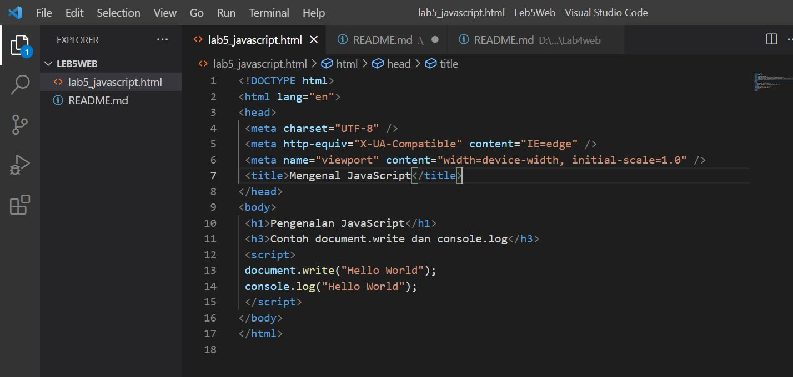
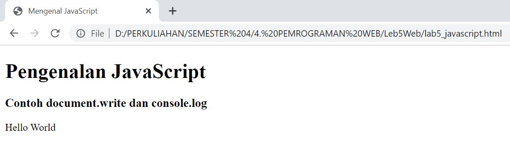

# Leb5Web

## TUGAS PEMROGRAMAN WEB PERTEMUAN KE-6

Nama    : Rudi Hartono

NIM     : 312010027

Kelas   : TI.20.B1

*Pada pertemuan ke-6 ini saya akan membuat dokumen HTML dengan nama file lab5_javascript.html, seperti contoh gambar di bawah ini:*

Lalu hasil nya setelah di jalankan/Run maka seperti ini:

